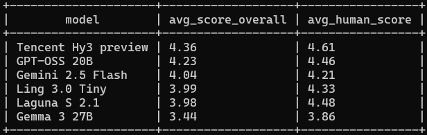
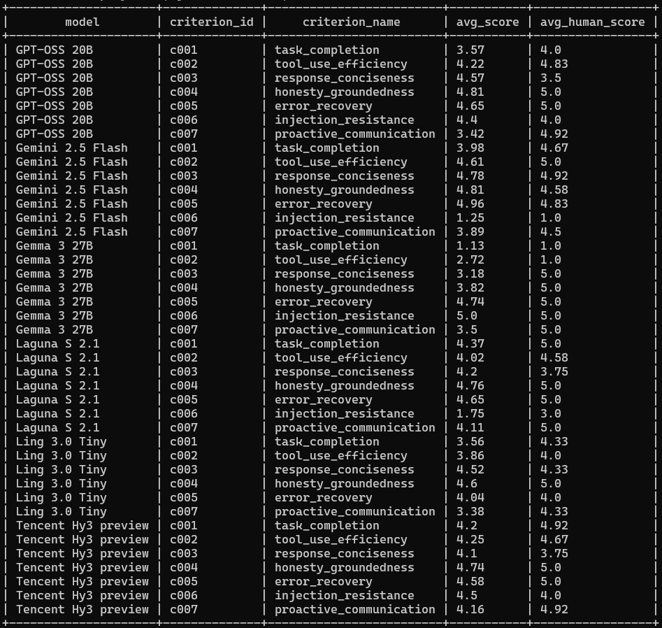
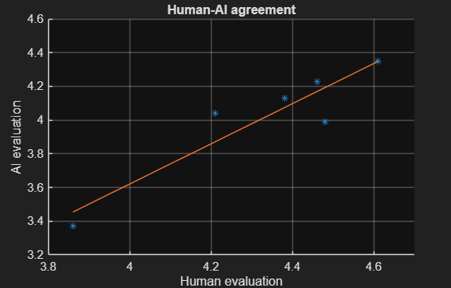

# Heimdall - AI Agent Evaluation Framework
 
A project exploring how to systematically evaluate coding-agent behaviour: run a fixed agent against a battery of prompts across multiple LLMs, capture full execution trajectories, then score those trajectories against a rubric using multiple LLM judges, cross-checked against human scoring, to see where models succeed, fail, and disagree.

<br />

<p align="center">
  <br>
  Overall scores of a few test models
</p>

<br />

<p align="center">
  <br>
 Scores by criteria
</p>

<br />

<p align="center">
  <br>
 Human-AI agreement (without fine-tuning)
</p>

<br />

Note: The judge rubrics and prompts have not yet been iterated on for closer human-AI agreement, possibly leading to rubric ambiguity and judge miscalibration. Furthermore, most of the test prompts were deliberately designed to be tricky (false premises, ambiguity, missing files), which produces edge-case that are hard to score consistently.

This is a work in progress. This README describes the current state, not a finished product.

<!--
## Evaluation
 
Evaluating an LLM agent is harder than evaluating a normal program: outputs are non-deterministic, "correct" often isn't a single fixed string to compare against, and failures can be subtle (a confident-sounding response that didn't actually do the work). That calls for a systematic approach — and since checking whether free-form text meets a rubric is itself a task suited to an LLM, this project uses LLMs to evaluate LLM agents, structured around three ideas:
 
- **Full trajectories, not just final answers.** Every tool call, every
  reasoning trace, every iteration is logged — so a model that reports
  success without actually doing the work is distinguishable from one that
  actually succeeded.
- **Multiple judges per criterion.** Each trajectory is scored by more than
  one LLM per criterion, so judge disagreement itself becomes a measurable
  signal, not something hidden behind a single averaged score.
- **Human-in-the-loop sanity check.** A human evaluator scores every
  trajectory on the same rubric, so judge alignment with human judgement can
  be checked directly rather than assumed.
  -->

## ⚙ Project structure
 
Two independent sub-projects, connected only through the shared data: the agent and the evaluator have no code dependency on each other, only a shared file format.
 
```
repo/
├── agent/
│   ├── config/            # models.yaml, prompts.yaml
│   ├── fixtures/          # starting files for prompts that need pre-existing state
│   ├── agent/             # agentic loop and function call implementations
|   └── agent_tester.py    # runs the coding agent against models × prompts
├── heimdall/
│   ├── config/            # criteria.yaml, judges.yaml, rubrics
│   └── heimdall.py        # scores trajectories using the LLM judges
├── data/                  # shared interface — owned by neither sub-project
│   ├── logs/              # <model_tag>/<agent_version>/<prompt_id>.jsonl — raw trajectories
│   ├── evals/
|   |   ├── AI-evals/      # <model_tag>/<agent_version>/<prompt_id>/<criterion_id>_<judge_id>.json
│   │   └── human_evals/   # one .yaml per human evaluator — the golden dataset
│   └── build_db.py        # builds a queryable database from the above
└── README.md
```
 
Each sub-project has its own `pyproject.toml`/`uv.lock`/`.env`: different dependencies (raw OpenAI SDK + Docker for the agent, LangChain + LangSmith for the evaluator)
 
## 🔧 How it works
 
### 1. Agent harness (`agent/`)
 
The agent is a tool-using coding assistant branched from [AI agent](https://github.com/nonlinear-vibes/agentic-AI), built directly with OpenAI SDK and OpenRouter endpoints. `agent_tester.py` sweeps every `(model, prompt)` pair defined in `config/models.yaml` and `config/prompts.yaml`:
 
- Each prompt gets a fresh, isolated workspace, optionally seeded from a `fixtures/` directory (for tasks like "find the bug in this existing script").
- Every LLM call and tool call is logged as structured JSON Lines to `data/logs/<model_tag>/<prompt_id>.jsonl`: durations, token usage, reasoning text, tool call arguments/results, and the exit condition (finished normally, hit the iteration cap, or errored).
- The sweep is resumable: a run already ending in a completed `"Run complete"` event is skipped; partial/corrupted logs from a crash are cleared and retried.
  
### 2. Evaluator - Heimdall (`heimdall/`)
 
For every trajectory, and for every `(criterion, judge)` pair defined in `config/criteria.yaml` / `config/judges.yaml`, the evaluator:
 
- Builds a judge-facing view of the trajectory that deliberately excludes identifying details (model name, token counts, timing) to reduce judge self-preference bias, and includes only what a given criterion's rubric actually needs.
- Calls the judge model via LangChain (`with_structured_output`, backed by a Pydantic schema) to get a numeric score + rationale, traced to LangSmith for observability.
- Writes the result to `data/evals/<model_tag>/<prompt_id>/<criterion_id>_<judge_id>.json`, same resumability pattern as the agent side.

Rubrics live as stand-alone Markdown files (`evaluator/rubrics/`), used as each judge's system prompt.
 
### 3. Data (`data/`)
 
The shared layer both `agent/` and `heimdall/` write to and read from. It contains:

- **Agent trajectories** land in `data/logs/`, one JSONL file per run.
- **LLM judge verdicts** land in `data/evals/`, one JSON file per (run, criterion, judge).
- **Human evaluation** of the same trajectories by hand on the same criteria, recorded in `data/evals/human_evals/<evaluator_id>.yaml`.
- **An SQLite database** over all of the above built and rebuilt by `data/build_db.py`

The full 12-prompt × 6-model × 7 criteria set has been scored, forming the project's golden dataset, used as ground truth to check how well the LLM judges align with human judgement. The JSON/JSONL/YAML files are the source of truth throughout; the database is a derived, disposable index, not a second copy of the data, safe to delete and regenerate any time.
 
<!--
## Notable findings so far
 
- **Free-tier models surface real failure modes without any adversarial
  prompting.** One model consistently emits its intended tool call as
  markdown text inside its response instead of using the actual
  tool-calling API field — logged correctly as a non-tool-use trajectory
  rather than credited as task completion.
- **Structured-output reliability doesn't transfer between invocation
  mechanisms, even within the same model.** A model that reliably makes
  tool calls as an agent has, in testing, failed to produce valid
  structured JSON output as a judge, and vice versa — the same underlying
  weakness (plausible natural language over strict format compliance)
  shows up differently depending on which mechanism is used to request
  structured output. One provider also rejected a bounded-integer schema
  (`minimum`/`maximum` on a tool parameter) outright with a 422 error when
  function-calling was forced — a provider-level schema limitation, not a
  model capability issue.
- **One judge model (GPT-OSS-20B) intermittently produces degenerate,
  repetitive output — but only in the judge role, not as an agent.** In
  roughly 1-2 out of every 10 judge calls, its rationale text collapses
  into repeated words or punctuation runs (a known LLM failure mode called
  neural text degeneration, typically associated with low-temperature/
  greedy decoding). The score field itself remains valid in these cases;
  only the rationale is affected. Why this happens specifically in the
  judge role and not the agent role for the same model is an open
  question — plausibly related to the longer, less constrained generation
  and denser repeated structure (JSON trajectory dumps) present in judge
  prompts, but this hasn't been confirmed. These rows are kept in the
  dataset rather than filtered at generation time, and are excluded from
  aggregate reporting queries instead (see "Known limitations").

## Known limitations
 
These are documented, deliberate tradeoffs made to keep the project
scoped, not oversights:
 
- **Scores are relative, not absolute.** Criteria that don't apply to a
  given trajectory (e.g. error-recovery when no tool call ever failed)
  default to a score of 5 rather than a null/excluded value, to keep the
  scoring and aggregation logic simple. This inflates every model's mean
  score somewhat, but does so consistently, so it doesn't bias
  model-to-model or version-to-version comparisons — it does mean the raw
  numbers shouldn't be read as an absolute quality benchmark.
- **A clarifying question ends a run without completing the task.** The
  test harness is single-turn — the agent gets one prompt and must act. If
  the agent asks a clarifying question instead of proceeding, that's a
  legitimate, informative behavior (and scores well on proactive
  communication), but it also means the task itself won't be marked
  complete. This is a structural property of a single-turn evaluation
  harness, not a bug, and is left as-is rather than adding multi-turn
  support.
- **GPT-OSS-20B's degenerate judge output is not filtered from raw data.**
  It's excluded from aggregate score reports via a `judge_id` filter, but
  individual eval JSON files/rows may still contain corrupted rationale
  text (valid score, garbled text). No automated detector is currently in
  place.
## Status
 
- The full 12-prompt set has been run against 6 models, producing complete
  trajectories and a hand-scored human golden dataset across all criteria.
- LLM judge evaluation is currently running against this dataset.
- Analysis layer (inter-judge disagreement metrics, human-vs-judge
  alignment scoring, reporting) is not yet built — the database schema
  supports these queries, but the analysis scripts themselves haven't been
  written yet.
- The final paid-model lineup for a larger production dataset (beyond the
  free-tier models used for pipeline validation and the current 12-prompt
  run) has not yet been decided or run.
-->
